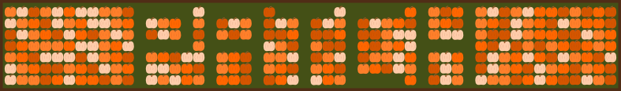
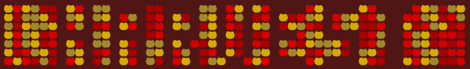
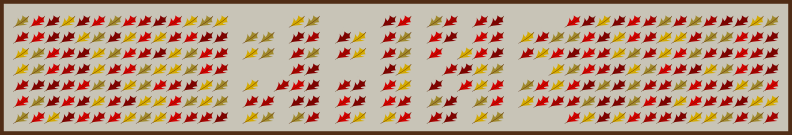
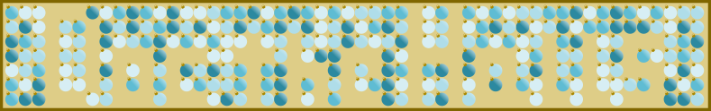

## Holiday Hackathon Logos

This repo contains a collection of tacky, holiday-themed hackathon logos. These logos could be used for event branding, laptop stickers, etc. While this project was largely inspired by Digital Ocean's [Hacktoberfest](https://hacktoberfest.digitalocean.com/), each of the themes below hits on specific topics related to repo *maintenance* to encourage upkeep and contribution over novelty and innovation.

## Themes

There are two main types of designs in this repo. 

Those ending with `-grid.png` are intended to be mildly remininiscent of the GitHub activity grid. Often, some cells are deleted to spell a phrase (e.g. "Patch" or "Harvest" for October and November). 

Most else ends in `-badge.png` and is something that I just found entertaining. 

Within the `svg-final` directory, there is also a file `objects.png` which includes a lot of the primitive shapes (e.g. pumpkins, Chrstimas lights) that I used to make the logos.

## Contributions Welcome

Right now, the contents of this repo is biased towards holidays and traditions that I'm most familiar with. I do not in any way mean to be exclusive, but I'm most capable of making bad puns about these and it feels most appropriate for me to do so. I welcome contributions that would increase the diversity!

## Previews

### January

New year, new resolutions, old tools. Take some time to come together as a team *without* building and simply make a plan. Think about where priorities overlap and what can be built collaboratively or re-used instead of reinvented.

### February

When codebases have few contributors or maintainers, they are more susceptible to going stale. Take the opportunity to do some "matchmaking" between orphaned packages and potential maintainers or, alternatively, help new maintainers get into relationships with existing projects.

### March

See a tool that doesn't quite meet your need? Work on an enhancement instead of starting a new project.

### April

Tech debt [is not a bad thing](https://changelog.com/podcast/379), but it's an investment that needs to get paid down. Take some time to identify and pay down the accumulated debt in your projects.

### May (TBD)

### June (TBD)

### July

Dependencies are great for quick prototyping, but do you really need them all when you launch? Re-evaluate and potentially remediate dependencies in your project. 

### August (TBD)

### September (TBD)

### October

Pumpkin patch - code patch. Need I say more?

### November

It's time for the fall harvest! If your work isn't on GitHub and optimized for discoverability (README, Description, tags, etc.), harvest them off your hard-drive and bring them into a GitHub repo or org.

Alternatively, fall is also a great time for *branch pick-up* as the leaves fall. Consider raking your repo to clear up unused or outdated branches. This can eliminate confusion and help new maintainers join your project.

### December

"Doc (deck) the halls" with documentation! 

Is your code naughty or nice? You'll never know if you don't have unit tests.

### Thanks

All logos were made with [Inkscape](inkscape.org), a great FOSS software. This project was mostly motivated by my wanting to learn Inkscape basics and needing a use case. One great resource I used a lot was YouTube videos from [Logos by Nick](https://logosbynick.com/). 